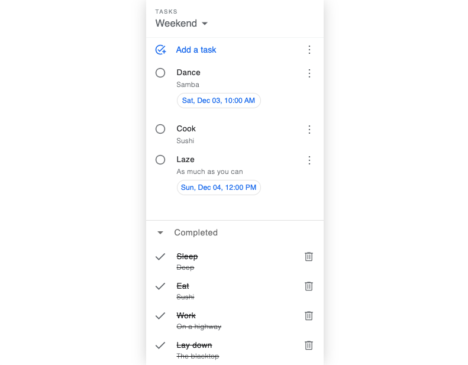

# Tasks

[Check live!](https://mrzadzinski.github.io/to-do-list/)

Simplified reproduction of my favorite checklist app: Google Tasks.

Dummy content provided for quick functionality test.

## Features

- Create multiple lists
- Move tasks between them
- Sort tasks by:
  - Name
  - Date
  - Custom
- Expandible list for completed tasks
- Delete all completed tasks at once
- Local storage

## Technologies

- Webpack
- Javascript
- SCSS
- HTML
- Npm
- Basics of JSON

## Skills practiced

- Webpack setup
- Usage of local storage
- Usage of external library
- Working with JS modules
- Drag and drop API
- DOM manipulation

## Acknowledgments

- This project was an assignment from The Odin Project course: [Todo List](https://www.theodinproject.com/lessons/node-path-javascript-todo-list)
- Special thanks to Google Developers for creating my favorite checklist app, thus providing wonderful practice material
